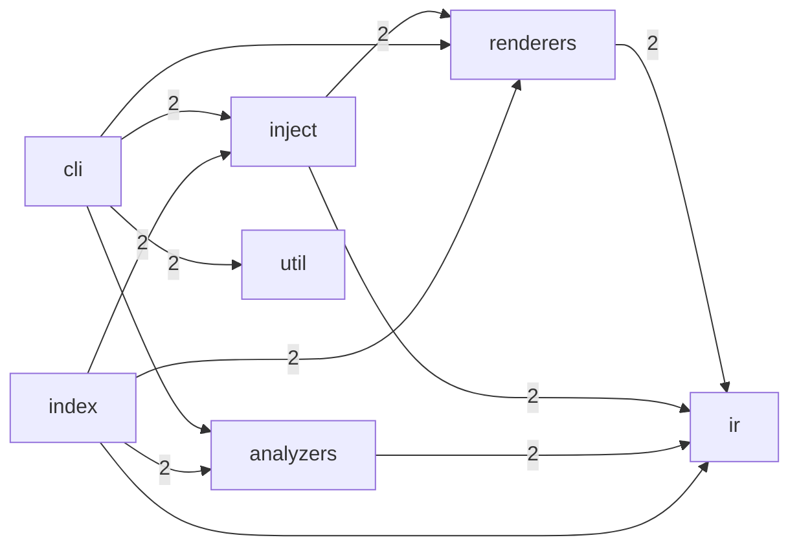

# repolore

> Visualize a Git repository from multiple angles. One command, GitHub-native Mermaid output, no SaaS required.

[](https://www.npmjs.com/package/repolore)
[](./LICENSE)

**Status:** Alpha. Phase 1 (architecture viewpoint, Mermaid output, TypeScript/JavaScript repos) is implemented; multi-viewpoint, multi-format, and LLM curation are on the roadmap below.

## Why repolore?

The "repo summarizer for LLMs" space exploded with [repomix](https://github.com/yamadashy/repomix) (25k★) and [gitingest](https://github.com/coderamp-labs/gitingest) (15k★), but **none of them generate diagrams**. Meanwhile, existing diagram tools each cover only one viewpoint:

| Tool | Viewpoint | Output | Local-first |
|---|---|---|---|
| [gitdiagram](https://github.com/ahmedkhaleel2004/gitdiagram) | architecture | Mermaid | SaaS-first |
| [madge](https://github.com/pahen/madge) | deps | SVG / DOT | ✓ |
| [dependency-cruiser](https://github.com/sverweij/dependency-cruiser) | deps | Mermaid / DOT / HTML | ✓ |
| [gource](https://github.com/acaudwell/Gource) | git history | OpenGL video | ✓ |
| [git-truck](https://github.com/git-truck/git-truck) | history × size | interactive web | ✓ |
| **repolore** | **multiple, fused** | **Mermaid (GitHub-native)** | **✓** |

The differentiator is **fusing git-history with code-structure in one view** — a combination no existing tool offers.

## Quick start

```bash
# In any TypeScript/JavaScript repo
npx repolore
# → writes docs/diagrams/architecture.md
```

Inject into your README at markers:

```bash
npx repolore --inject README.md
```

Then in your `README.md`, add (note: examples shown in fenced code blocks below are ignored by the injector):

```markdown
<!-- repolore:start -->
<!-- repolore:end -->
```

repolore regenerates the content between the markers and preserves everything else.

## What it generates (Phase 1)

A Mermaid `flowchart LR` of your top-level modules with import-weighted edges:

<!-- repolore:start -->
<!-- Generated by repolore v0.1.0-alpha.0 -->

### Architecture overview

Module-level structure of repolore. Nodes are top-level source directories; edges represent aggregated import dependencies (weight = import count).



<!-- repolore:end -->

GitHub renders this natively — no images, no external services.

## CLI

```text
Usage: repolore [path]

Options:
  -o, --output <dir>      Output directory (default: docs/diagrams)
  --viewpoints <list>     Comma-separated viewpoint IDs (default: architecture)
  --format <fmt>          Output format (default: mermaid)
  --max-nodes <n>         Cap nodes per diagram (default: 100)
  --max-edges <n>         Cap edges per diagram (default: 200)
  --inject <file>         Inject into a Markdown file at injection markers
  --quiet                 Suppress non-error output
  -v, --version
  -h, --help
```

Defaults are tuned to GitHub's Mermaid renderer limits (max 500 edges hard, ~50KB source). repolore caps at 100/200/25KB and prunes by centrality if you exceed them.

## Design principles

- **Local-first.** No SaaS dependency for the default path. Your code never leaves your machine unless you opt into LLM curation (Phase 3, BYOK).
- **GitHub-native.** Mermaid is the primary format because it renders in READMEs, Wikis, Issues, PRs, and Gists without any pipeline.
- **One IR, many renderers.** Analyzers produce an intermediate JSON; renderers (Mermaid first, SVG / DOT / Wiki next) consume it. New formats are plugins.
- **MIT, no AGPL traps.** OSS maintainers can embed the output anywhere.

## Roadmap

- **Phase 1** *(current)* — architecture viewpoint, Mermaid output, TS/JS
- **Phase 2** — `deps` + `git-history` viewpoints
- **Phase 3** — LLM curator (BYOK OpenAI / Anthropic / Ollama / none), budget cap, privacy guards
- **Phase 4** — Python and Go analyzers
- **Phase 5** — SVG / DOT / Wiki-Markdown renderers
- **Phase 6** — Claude Code skill (`/visualize-repo`)
- **Phase 7** — GitHub Action (auto-regenerate on PR)
- **Phase 8** — Public web demo

## License

[MIT](./LICENSE)
