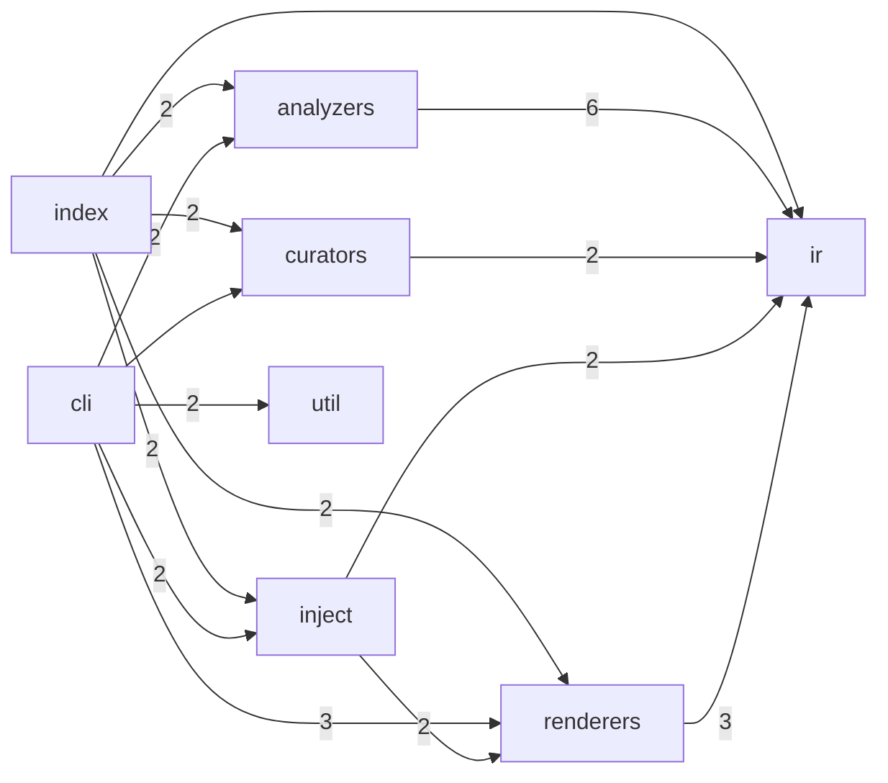
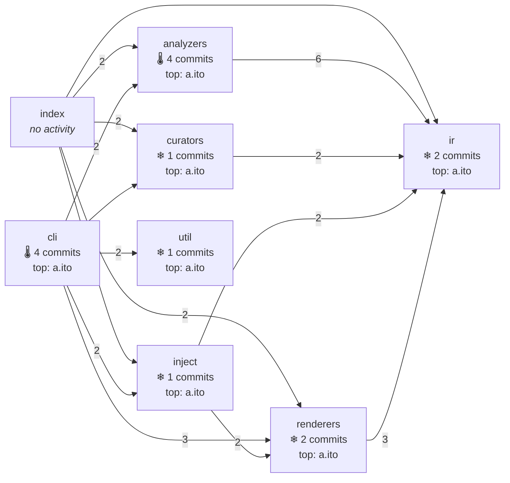
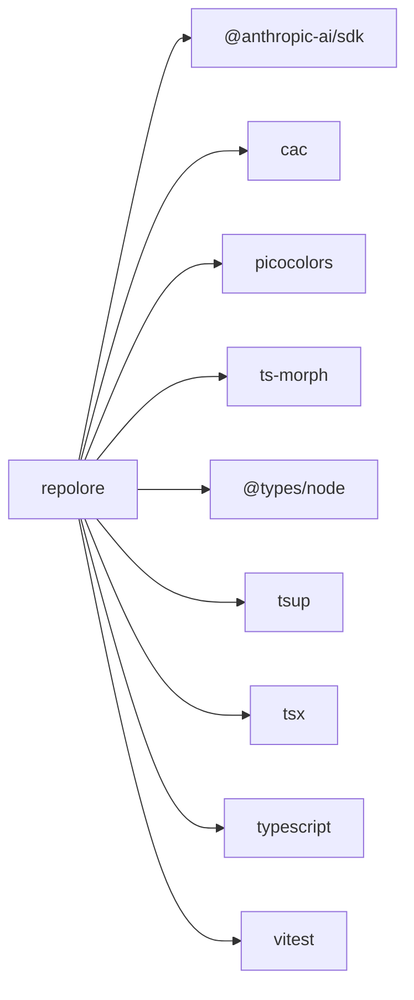

# repolore

> Visualize a Git repository from multiple angles. One command, GitHub-native Mermaid output, no SaaS required.

[](https://www.npmjs.com/package/repolore)
[](./LICENSE)

**Status:** Alpha. Phases 1–5, 2.5, and 7 are shipped: **five viewpoints** including the marquee `architecture-history` fusion (`architecture`, `architecture-history`, `deps`, `git-history`, `python`), two output formats (Mermaid, DOT), Claude Code skill, GitHub Action, and BYOK Anthropic LLM curation. Go analyzer, SVG output, OpenAI/Ollama curators, and a public web demo are still on the roadmap.

## Why repolore?

The "repo summarizer for LLMs" space exploded with [repomix](https://github.com/yamadashy/repomix) (25k★) and [gitingest](https://github.com/coderamp-labs/gitingest) (15k★), but **none of them generate diagrams**. Meanwhile, existing diagram tools each cover only one viewpoint:

| Tool | Viewpoint | Output | Local-first |
|---|---|---|---|
| [gitdiagram](https://github.com/ahmedkhaleel2004/gitdiagram) | architecture | Mermaid | SaaS-first |
| [madge](https://github.com/pahen/madge) | deps | SVG / DOT | ✓ |
| [dependency-cruiser](https://github.com/sverweij/dependency-cruiser) | deps | Mermaid / DOT / HTML | ✓ |
| [gource](https://github.com/acaudwell/Gource) | git history | OpenGL video | ✓ |
| [git-truck](https://github.com/git-truck/git-truck) | history × size | interactive web | ✓ |
| **repolore** | **multiple, fused** | **Mermaid (GitHub-native)** | **✓** |

The differentiator is **fusing git-history with code-structure in one view** — a combination no existing tool offers. That fusion ships as `--viewpoints architecture-history`: same module graph as `architecture`, but each node is annotated with its commit count (🔥/🌡/❄ heat tier) and top author from the last 90 days. See the example diagrams below.

## Quick start

```bash
# In any TypeScript/JavaScript repo
npx repolore
# → writes docs/diagrams/architecture.md
```

Inject into your README at markers:

```bash
npx repolore --inject README.md
```

Then in your `README.md`, add (note: examples shown in fenced code blocks below are ignored by the injector):

```markdown
<!-- repolore:start -->
<!-- repolore:end -->
```

repolore regenerates the content between the markers and preserves everything else.

## What it generates (Phase 1)

A Mermaid `flowchart LR` of your top-level modules with import-weighted edges:

<!-- repolore:start -->
<!-- Generated by repolore v0.5.0-alpha.0 -->
<!-- Source commit: f475d4f9fb3d0ad038d5c6f012c9bec92dc4efb8 -->

### Architecture overview

Module-level structure of repolore. Nodes are top-level source directories; edges represent aggregated import dependencies (weight = import count).



### Architecture × git activity

Module structure (imports) overlaid with git activity. Each node carries commit count and top author from the last 90 days. Heat tier (🔥/🌡/❄): visual cue for the most-touched modules. This fusion is the differentiator from single-viewpoint tools (gource, git-truck, madge).



### External dependencies

Direct dependencies of repolore: 4 runtime, 5 dev. Solid arrows = runtime, dashed = dev/peer/optional.



### Git activity (since 90 days ago)

Modules ranked by commit count in the time window. Each node shows commit count and top author. Edges are intentionally omitted in this viewpoint — combine with the architecture viewpoint to see structure-vs-activity correlation.

```mermaid
flowchart LR
    README_md["README.md<br/>5 commits<br/>top: a.ito"]
    docs["docs<br/>5 commits<br/>top: a.ito"]
    package_json["package.json<br/>5 commits<br/>top: a.ito"]
    tests["tests<br/>5 commits<br/>top: a.ito"]
    analyzers["analyzers<br/>4 commits<br/>top: a.ito"]
    cli["cli<br/>4 commits<br/>top: a.ito"]
    index_ts["index.ts<br/>4 commits<br/>top: a.ito"]
    ir["ir<br/>2 commits<br/>top: a.ito"]
    renderers["renderers<br/>2 commits<br/>top: a.ito"]
    pnpm_lock_yaml["pnpm-lock.yaml<br/>2 commits<br/>top: a.ito"]
    action_yml["action.yml<br/>1 commits<br/>top: a.ito"]
    curators["curators<br/>1 commits<br/>top: a.ito"]
    _github[".github<br/>1 commits<br/>top: a.ito"]
    _gitignore[".gitignore<br/>1 commits<br/>top: a.ito"]
    LICENSE["LICENSE<br/>1 commits<br/>top: a.ito"]
    inject["inject<br/>1 commits<br/>top: a.ito"]
    util["util<br/>1 commits<br/>top: a.ito"]
    tsconfig_json["tsconfig.json<br/>1 commits<br/>top: a.ito"]
    tsup_config_ts["tsup.config.ts<br/>1 commits<br/>top: a.ito"]
    vitest_config_ts["vitest.config.ts<br/>1 commits<br/>top: a.ito"]
```



<!-- repolore:end -->

GitHub renders this natively — no images, no external services.

## CLI

```text
Usage: repolore [path]

Options:
  -o, --output <dir>      Output directory (default: docs/diagrams)
  --viewpoints <list>     Comma-separated viewpoint IDs (default: architecture)
                          Available: architecture, architecture-history,
                                     deps, git-history, python
  --format <list>         Comma-separated output formats (default: mermaid)
                          Available: mermaid, dot
  --max-nodes <n>         Cap nodes per diagram (default: 100)
  --max-edges <n>         Cap edges per diagram (default: 200)
  --inject <file>         Inject Mermaid diagrams into a Markdown file at markers
  --curate <provider>     LLM curator: none (default) | anthropic
                          (sends node metadata to provider)
  --curate-model <name>   Provider-specific model name
                          (Anthropic default: claude-haiku-4-5-20251001)
  --budget-usd <n>        Max LLM spend per run; hard-fail above (default: 0.10)
  --quiet                 Suppress non-error output
  -v, --version
  -h, --help
```

Defaults are tuned to GitHub's Mermaid renderer limits (max 500 edges hard, ~50KB source). repolore caps at 100/200/25KB and prunes by centrality if you exceed them.

## Design principles

- **Local-first.** No SaaS dependency for the default path. Your code never leaves your machine unless you opt into LLM curation (Phase 3, BYOK).
- **GitHub-native.** Mermaid is the primary format because it renders in READMEs, Wikis, Issues, PRs, and Gists without any pipeline.
- **One IR, many renderers.** Analyzers produce an intermediate JSON; renderers (Mermaid first, SVG / DOT / Wiki next) consume it. New formats are plugins.
- **MIT, no AGPL traps.** OSS maintainers can embed the output anywhere.

## LLM curation (Phase 3, BYOK)

By default `repolore` is **fully offline** — your code never leaves the machine. Enable LLM curation to enrich node labels with 1-line semantic summaries:

```bash
export ANTHROPIC_API_KEY=sk-ant-...
repolore --curate anthropic --budget-usd 0.05
```

What gets sent: **only module/file names and the viewpoint title**, never source code. Default model is Haiku 4.5 (~$0.001 per typical repo). `--budget-usd` is a hard cap — exceeding the pre-call estimate aborts.

Planned: `--curate openai` and `--curate ollama` (fully local via Ollama, zero remote traffic).

## GitHub Action

Use repolore in any GitHub workflow:

```yaml
# .github/workflows/diagrams.yml
on:
  push:
    branches: [main]
jobs:
  diagrams:
    runs-on: ubuntu-latest
    permissions: { contents: write }
    steps:
      - uses: actions/checkout@v4
      - uses: BoxPistols/repolore@main
        with:
          viewpoints: architecture,deps,git-history
          inject: README.md
      - run: |
          git config user.email "actions@github.com"
          git config user.name "GitHub Actions"
          git add docs/diagrams README.md
          git diff --cached --quiet || git commit -m "chore: regenerate diagrams" && git push
```

The action installs from this repo on the fly until the npm package ships. See [`action.yml`](./action.yml) for all inputs.

## Roadmap

- **Phase 1** ✅ — architecture viewpoint, Mermaid output, TS/JS
- **Phase 1.5** ✅ — Claude Code skill (`/visualize-repo`)
- **Phase 2** ✅ — `deps` + `git-history` viewpoints
- **Phase 3** ✅ — LLM curator (BYOK Anthropic Haiku 4.5)
- **Phase 4** ✅ — Python analyzer (regex-based; AST upgrade later). Go: planned
- **Phase 5** ✅ — DOT renderer. SVG: planned (needs `mmdc` binary)
- **Phase 7** ✅ — GitHub Action (`action.yml` composite action)
- **Phase 2.5** *(current)* ✅ — `architecture-history` viewpoint (marquee differentiator)
- **Phase 3.1** — `--curate openai`, `--curate ollama` (offline LLM)
- **Phase 4.5** — Go analyzer
- **Phase 5.5** — SVG renderer (via mmdc spawn or pre-rendered SVG fallback)
- **Phase 8** — public web demo

## License

[MIT](./LICENSE)
