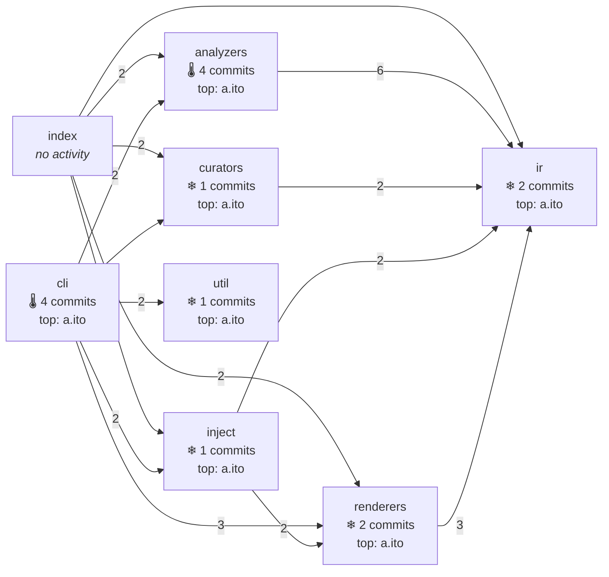

<!--
  Generated by repolore v0.5.0-alpha.0.
  Do not edit manually — re-run repolore to regenerate.
  Source commit: f475d4f9fb3d0ad038d5c6f012c9bec92dc4efb8
-->

# Architecture × git activity

Module structure (imports) overlaid with git activity. Each node carries commit count and top author from the last 90 days. Heat tier (🔥/🌡/❄): visual cue for the most-touched modules. This fusion is the differentiator from single-viewpoint tools (gource, git-truck, madge).

_Stats: 8 nodes, 15 edges, 814 bytes._
