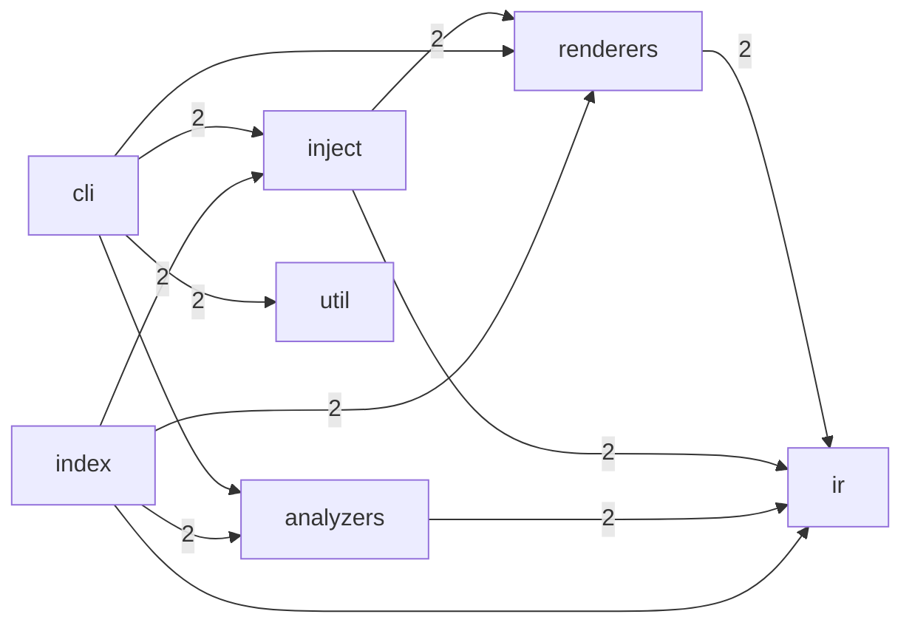

<!--
  Generated by repolore v0.1.0-alpha.1.
  Do not edit manually — re-run repolore to regenerate.
  Source commit: ea0afc5cb6ca0d63be47875cc44567f4c526a209
-->

# Architecture overview

Module-level structure of repolore. Nodes are top-level source directories; edges represent aggregated import dependencies (weight = import count).

_Stats: 7 nodes, 12 edges, 447 bytes._
