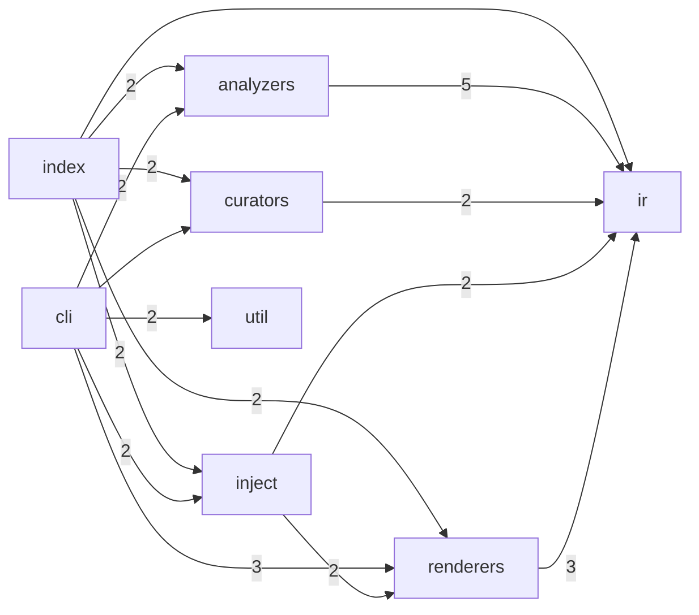

<!--
  Generated by repolore v0.4.0-alpha.0.
  Do not edit manually — re-run repolore to regenerate.
  Source commit: 0e3f449b5436b42b066d439d665f4c9d0f23f089
-->

# Architecture overview

Module-level structure of repolore. Nodes are top-level source directories; edges represent aggregated import dependencies (weight = import count).

_Stats: 8 nodes, 15 edges, 556 bytes._
