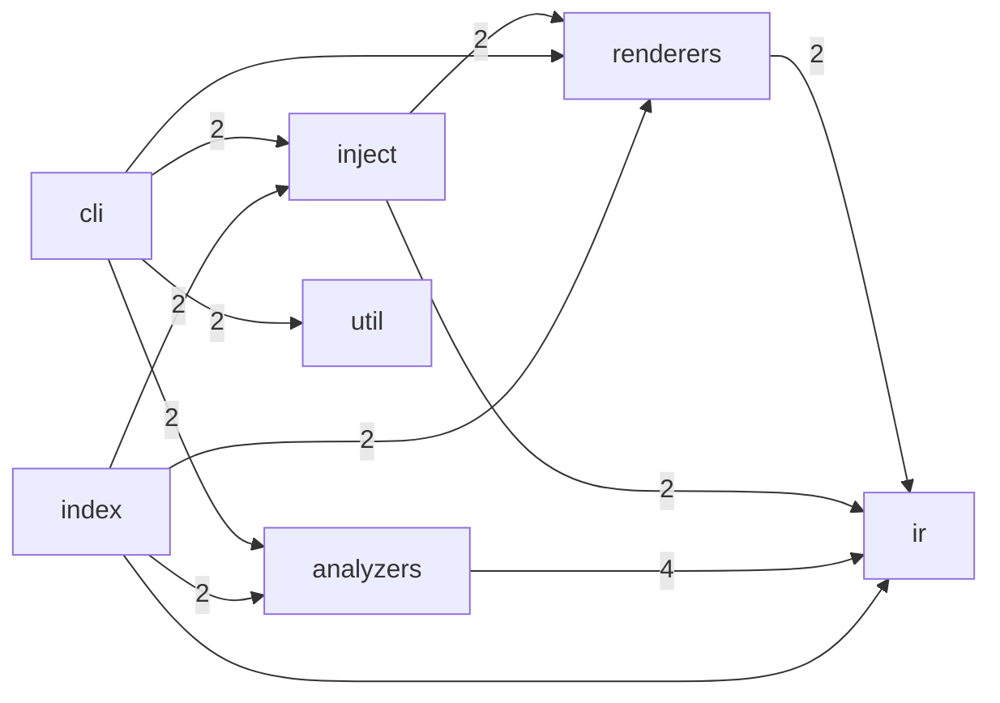

<!--
  Generated by repolore v0.2.0-alpha.0.
  Do not edit manually — re-run repolore to regenerate.
  Source commit: dab5f53213ed70a645d8a3b5c0aa33c1850c37f0
-->

# Architecture overview

Module-level structure of repolore. Nodes are top-level source directories; edges represent aggregated import dependencies (weight = import count).

_Stats: 7 nodes, 12 edges, 452 bytes._
