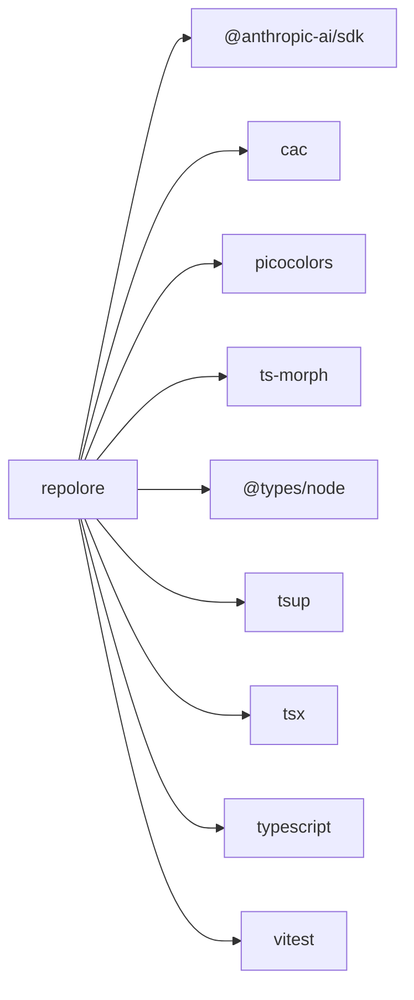

<!--
  Generated by repolore v0.4.0-alpha.0.
  Do not edit manually — re-run repolore to regenerate.
  Source commit: 0e3f449b5436b42b066d439d665f4c9d0f23f089
-->

# External dependencies

Direct dependencies of repolore: 4 runtime, 5 dev. Solid arrows = runtime, dashed = dev/peer/optional.

_Stats: 10 nodes, 9 edges, 496 bytes._
