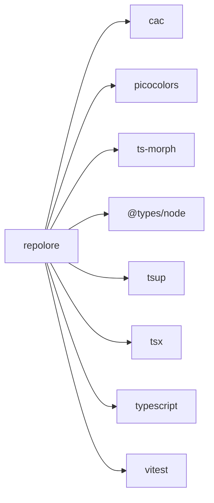

<!--
  Generated by repolore v0.2.0-alpha.0.
  Do not edit manually — re-run repolore to regenerate.
  Source commit: dab5f53213ed70a645d8a3b5c0aa33c1850c37f0
-->

# External dependencies

Direct dependencies of repolore: 3 runtime, 5 dev. Solid arrows = runtime, dashed = dev/peer/optional.

_Stats: 9 nodes, 8 edges, 418 bytes._
