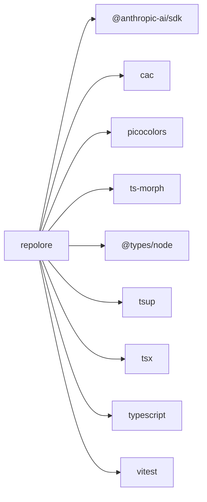

<!--
  Generated by repolore v0.3.0-alpha.0.
  Do not edit manually — re-run repolore to regenerate.
  Source commit: 7937595f377e432dca580a37ac54eeb3fafea566
-->

# External dependencies

Direct dependencies of repolore: 4 runtime, 5 dev. Solid arrows = runtime, dashed = dev/peer/optional.

_Stats: 10 nodes, 9 edges, 496 bytes._
