<!--
  Generated by repolore v0.4.0-alpha.0.
  Do not edit manually — re-run repolore to regenerate.
  Source commit: 0e3f449b5436b42b066d439d665f4c9d0f23f089
-->

# Git activity (since 90 days ago)

Modules ranked by commit count in the time window. Each node shows commit count and top author. Edges are intentionally omitted in this viewpoint — combine with the architecture viewpoint to see structure-vs-activity correlation.

```mermaid
flowchart LR
    README_md["README.md<br/>4 commits<br/>top: a.ito"]
    docs["docs<br/>4 commits<br/>top: a.ito"]
    package_json["package.json<br/>4 commits<br/>top: a.ito"]
    tests["tests<br/>4 commits<br/>top: a.ito"]
    cli["cli<br/>3 commits<br/>top: a.ito"]
    index_ts["index.ts<br/>3 commits<br/>top: a.ito"]
    analyzers["analyzers<br/>3 commits<br/>top: a.ito"]
    pnpm_lock_yaml["pnpm-lock.yaml<br/>2 commits<br/>top: a.ito"]
    curators["curators<br/>1 commits<br/>top: a.ito"]
    _github[".github<br/>1 commits<br/>top: a.ito"]
    _gitignore[".gitignore<br/>1 commits<br/>top: a.ito"]
    LICENSE["LICENSE<br/>1 commits<br/>top: a.ito"]
    inject["inject<br/>1 commits<br/>top: a.ito"]
    ir["ir<br/>1 commits<br/>top: a.ito"]
    renderers["renderers<br/>1 commits<br/>top: a.ito"]
    util["util<br/>1 commits<br/>top: a.ito"]
    tsconfig_json["tsconfig.json<br/>1 commits<br/>top: a.ito"]
    tsup_config_ts["tsup.config.ts<br/>1 commits<br/>top: a.ito"]
    vitest_config_ts["vitest.config.ts<br/>1 commits<br/>top: a.ito"]
```

_Stats: 19 nodes, 0 edges, 1054 bytes._
